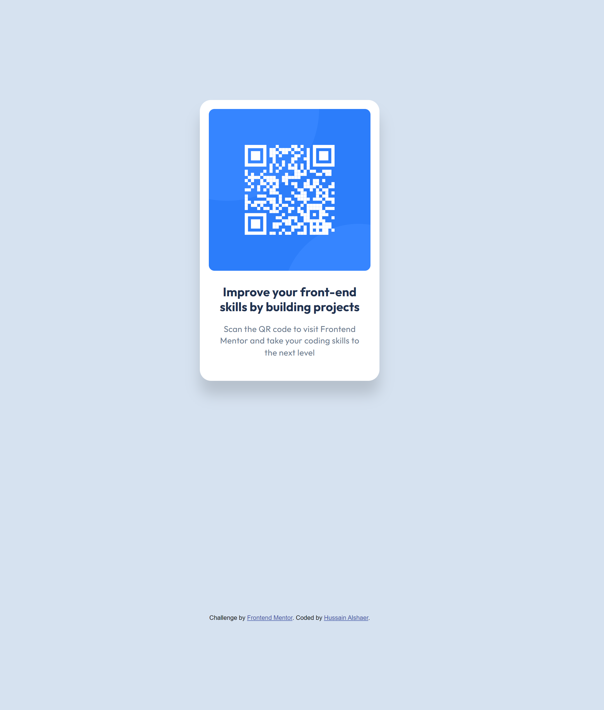
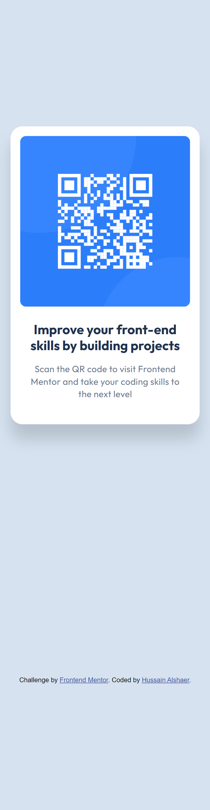

# Frontend Mentor - QR code component solution

This is a solution to the [QR code component challenge on Frontend Mentor](https://www.frontendmentor.io/challenges/qr-code-component-iux_sIO_H). Frontend Mentor challenges help you improve your coding skills by building realistic projects.

## Table of contents

- [Overview](#overview)
  - [Screenshot](#screenshot)
  - [Links](#links)
- [My process](#my-process)
  - [Built with](#built-with)
  - [What I learned](#what-i-learned)
  - [Continued development](#continued-development)
  - [Useful resources](#useful-resources)
- [Author](#author)
- [Acknowledgments](#acknowledgments)

## Overview

### Screenshot
##### 1440px view:


##### 350px view

### Links

- Solution URL: [Solution URL](https://github.com/hussaindev94/frontend-mentor-challenges-qr-code-component)
- Live Site URL: [Live Site](https://hussaindev94.github.io/frontend-mentor-challenges-qr-code-component/)

## My process

### Built with

- Semantic HTML5 markup
- CSS custom properties
- Flexbox
- CSS Grid
- Mobile-first workflow
  * Only using CSS Grid make it mobile responsive.

### What I learned
- Regarding the image:
  - Give it a max-width wiht px & width with percentage will make it more dynamic, instead of hard fix value.

    ```css
    width: 100%;
    max-width: 288px
    ```
- Regarding the card:
  - Give the container max-width with px, width with percentage and making the height fit-content will make the card grow to a limit dynamicaly  vertically by adding more contents and horizontally by changing the device wwidth.
    ```css
    max-width: 320px;
    width: 90%;
    height: fit-content;
    ```

### Continued development
- Adding proprties to interact with the users.
  - [hover](), transtion and transform.
  - [focus](), adding borders to make it standing out when the user interact with the card.
  - [onclcik](), make the card popup and add an overlay.

## Author

- Website - [Hussain AL-shaer](https://hussaindev94.github.io/Portfolio/)
- Frontend Mentor - [@hussaindev94](https://www.frontendmentor.io/profile/hussaindev94)
- |X|Twitter - [@hussaindev94](https://x.com/hussaindev94)
